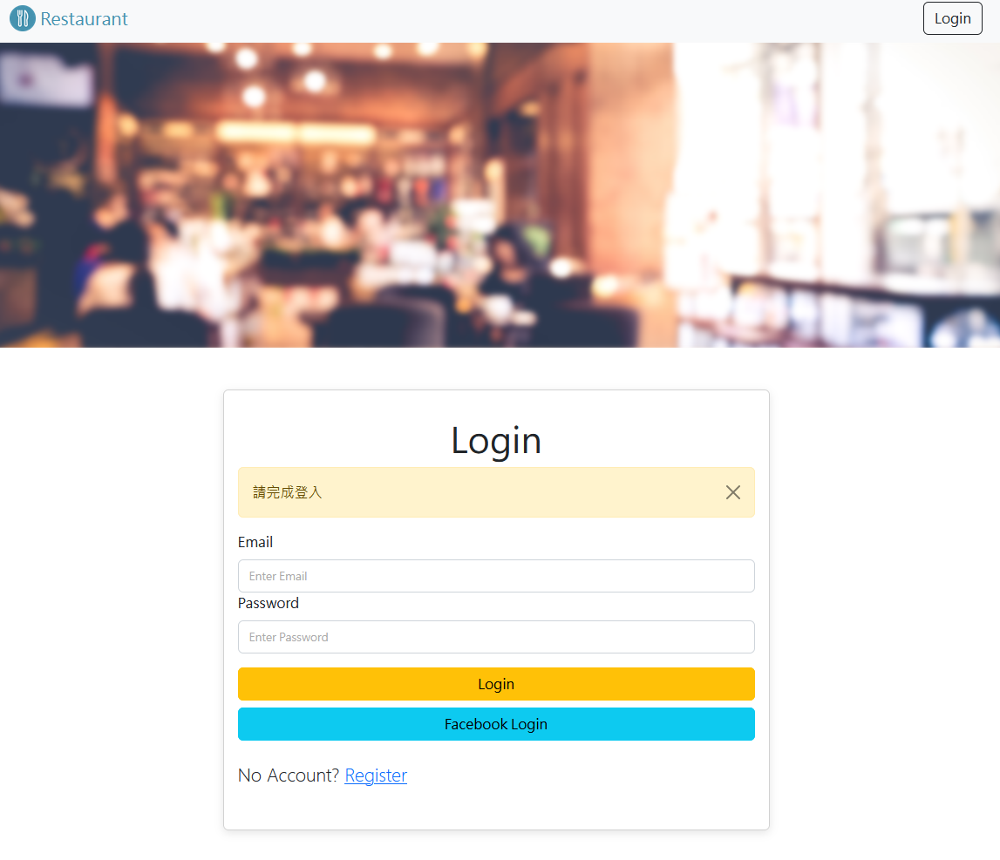

# RestaurantList

## 首頁


## 功能
* 使用者可以註冊帳號並登入，或是使用 Facebook 註冊及登入
* 使用者登入後可以搜尋、新增、修改及刪除資訊

## 開始使用

1. 請確認已安裝 node.js 與 npm
2. 將專案 clone 到本地

   ```bash
   git clone ...
   ```
3. 依照 .env.example 設定環境變數
4. 建立種子資料

   ```bash
   npm run seed
   ```

5. 在本地開啟之後，透過終端機進入資料夾，輸入：

   ```bash
   npm install
   ```

6. 安裝完畢後，繼續輸入：

   ```bash
   npm run start
   ```

7. 若看見此行訊息則代表順利運行，打開瀏覽器進入網址

   ```bash
   Listening on localhost:3000
   ```

## 開發工具

* bcryptjs: "^2.4.3"
* body-parser: "^1.20.1"
* connect-flash: "^0.1.1"
* dotenv: "^16.0.3",
* express: "^4.18.1",
* express-handlebars: "^6.0.6"
* express-session: "^1.17.1"
* method-override: "^3.0.0"
* mongoose: "^5.9.7"
* passport: "^0.6.0"
* passport-facebook: "^3.0.0"
* passport-local: "^1.0.0"


